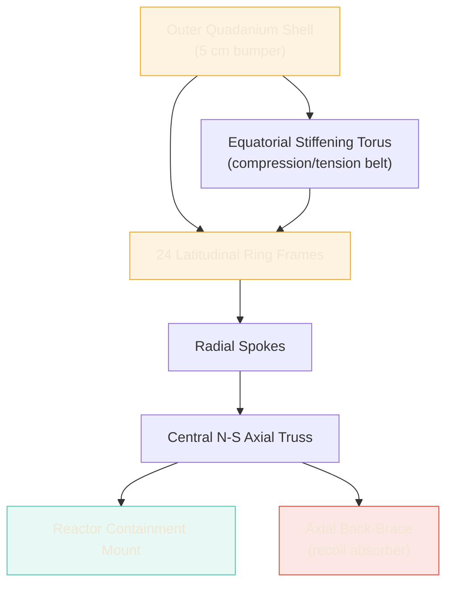
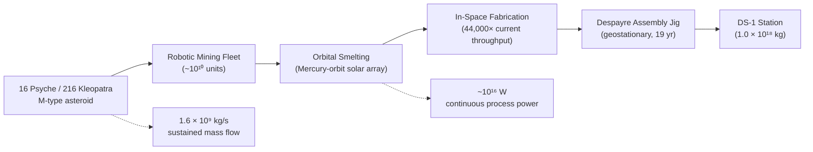
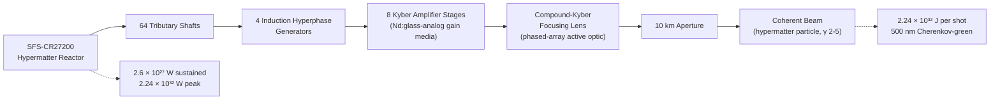
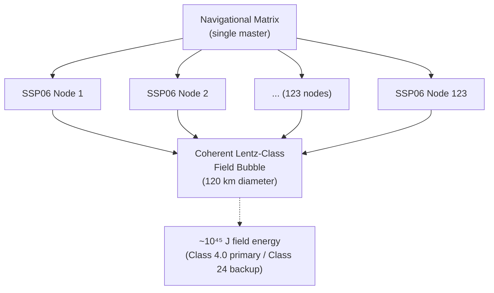
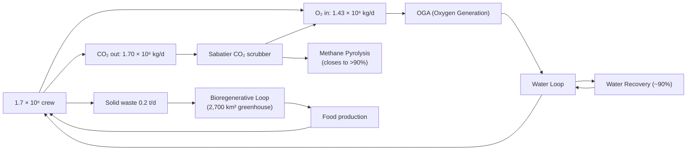
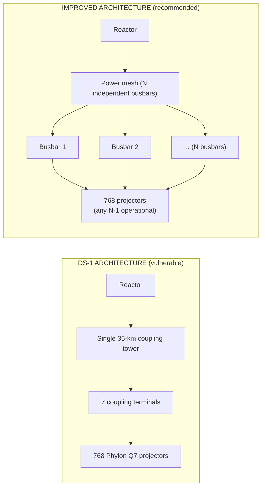
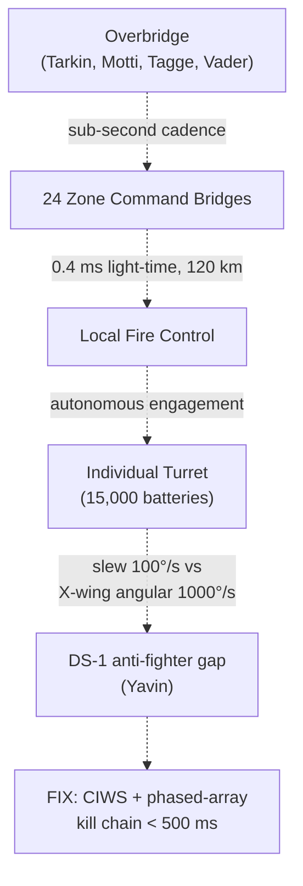
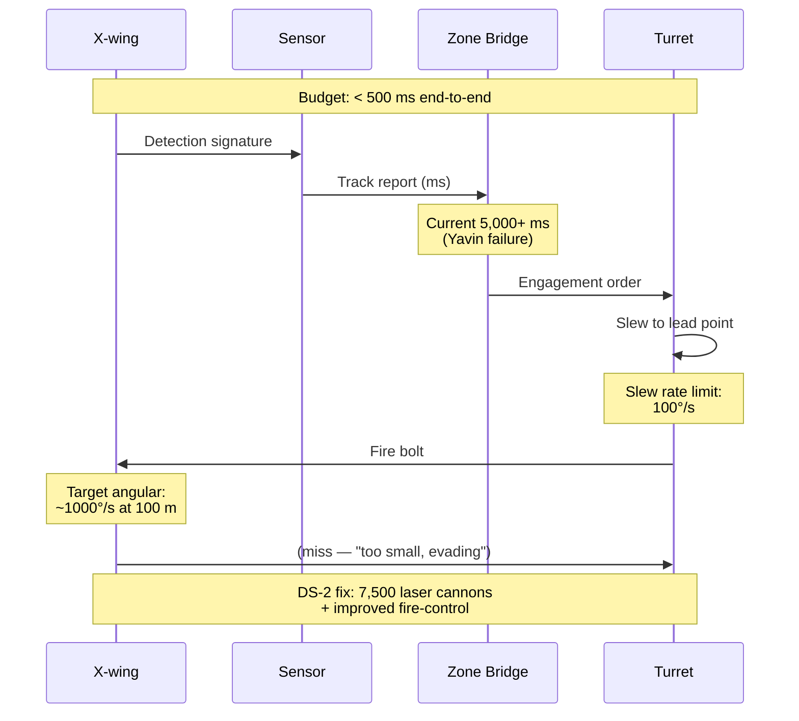
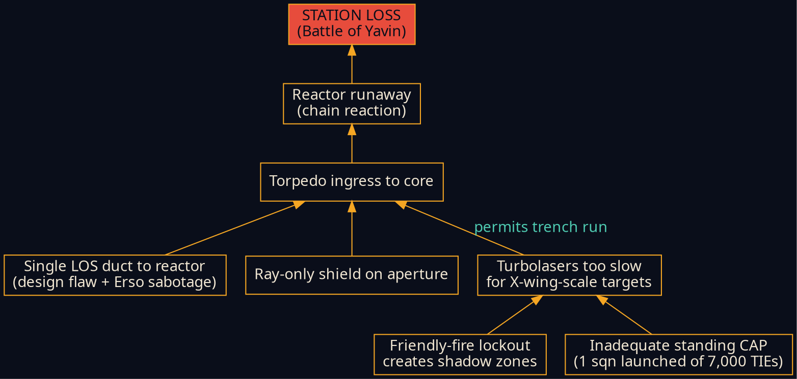
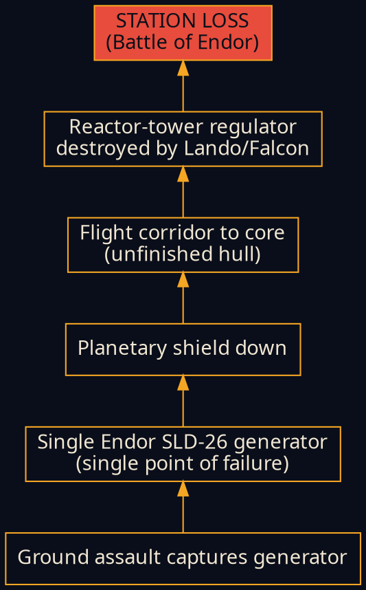

# Appendix D2 — Figure Generation Prompts (Nano Banana 2 + Mermaid + matplotlib)

**Source:** New synthesis (Phase 3 S3.0, 2026-04-22).
**Scope:** Production-ready prompts and recipes for every figure enumerated in `appendix-D-figures-and-tables.md` §D.3.
**Target consumer:** Google Gemini Nano Banana 2 image generation (illustrative figures); Mermaid / Graphviz (network / fault-tree / sequence); matplotlib / gnuplot (plots).

---

## D2.1 How to use this document

Every figure in the spec is assigned to exactly one production tool. The decision was made under decision D-7 (see `../to-dos/PROJECT-STATUS.md`): Nano Banana 2 for illustrative custom art; Mermaid/Graphviz for diagrams where graph correctness matters; matplotlib for plots where data accuracy matters.

**Workflow for illustrative figures (Group A):**

1. Open Gemini / Nano Banana 2 (or the API surface you're using).
2. Copy the entire prompt block for the target figure (including the `## Global style` preamble reference at the top).
3. Paste. Generate. Iterate with the variations guidance at the bottom of each block.
4. Save output to `docs/figures/<figure-id>.png` using the naming convention in §D2.11.
5. Update `appendix-D-figures-and-tables.md` §D.3 status column from `TBD` → `DRAFT` → `FINAL`.

**Workflow for Mermaid / Graphviz / matplotlib figures (Groups B, C):**

1. Copy the source snippet into the toolchain.
2. Export SVG (Mermaid/Graphviz) or PNG at 300 dpi (matplotlib).
3. Save to `docs/figures/<figure-id>.svg|.png`.

## D2.2 Production-tool matrix

| Figure | Title | Tool | Rationale |
|---|---|---|---|
| F-2.1 | Station cutaway, quarter-section | Nano Banana 2 | Illustrative showcase |
| F-2.2 | Equatorial trench cross-section | Nano Banana 2 | Illustrative + labels |
| F-2.3 | Load-path hierarchy | Mermaid | Graph correctness matters |
| F-2.4 | Thermal gradient across terminator | matplotlib | Plot accuracy |
| F-2.5 | Whipple shield stack cross-section | Nano Banana 2 | Illustrative, labeled |
| F-2.6 | M-type asteroid ISRU flowchart | Mermaid | Process diagram |
| F-3.1 | Reactor specific-energy vs fuel-mass | matplotlib | Log-log plot |
| F-3.2 | Hull radiated power vs temperature | matplotlib | Stefan-Boltzmann plot |
| F-3.3 | Reactor → beam conversion chain | Mermaid | Block diagram |
| F-4.1 | Superlaser amplifier chain schematic | Nano Banana 2 | Illustrative + labels |
| F-4.2 | Beam intensity vs damage threshold | matplotlib | Log-log plot |
| F-4.3 | Phased-array focusing geometry | Nano Banana 2 | Illustrative |
| F-4.4 | Planet-kill coupling model triptych | Nano Banana 2 | Illustrative |
| F-4.5 | Recoil & back-brace force path | Nano Banana 2 | Illustrative structural |
| F-5.1 | Sublight ion-array layout | Nano Banana 2 | Illustrative top-view |
| F-5.2 | 123-generator hyperdrive phase-lock | Mermaid | Network graph |
| F-5.3 | Lentz-soliton scaling | matplotlib | Plot |
| F-6.1 | ECLSS loop architecture | Mermaid | Flow diagram |
| F-6.2 | Internal transit mode comparison | matplotlib | Bar chart |
| F-6.3 | Hangar volumetric allocation | matplotlib | Pie / bar |
| F-7.1 | Ray vs particle shield diagram | Nano Banana 2 | Illustrative conceptual |
| F-7.2 | Tractor-beam busbar architecture | Mermaid | Network graph |
| F-7.3 | MARAUDER acceleration stages | Nano Banana 2 | Illustrative schematic |
| F-7.4 | DS-1 vs DS-2 exhaust port comparison | Nano Banana 2 | Illustrative comparison |
| F-8.1 | 24-zone station map | Nano Banana 2 | Sphere map illustrative |
| F-8.2 | C3 hierarchy + latency | Mermaid | Network + latency annotations |
| F-8.3 | Anti-fighter kill chain timeline | Mermaid | Sequence diagram |
| F-9.1 | Yavin exploit fault tree | Graphviz | Fault-tree convention |
| F-9.2 | Endor exploit fault tree | Graphviz | Fault-tree convention |
| F-A.1 | DS-1 vs DS-2 comparison plate | Nano Banana 2 | Illustrative |

**Count:** 14 Nano Banana 2 · 9 Mermaid · 2 Graphviz · 7 matplotlib. Totals 32 figure-slots for 30 titled figures (F-4.4 is a triptych panel, F-A.1 is a comparison plate — each counts as one deliverable).

---

## D2.3 Nano Banana 2 global style specification

**Include this block as the opening paragraph of every Group A prompt.**

> **STYLE:** Technical engineering blueprint illustration in the style of DK *Incredible Cross-Sections* and the West End Games *Death Star Technical Companion* (1991), with crisp vector-quality line work and a Star Wars Imperial schematic aesthetic. Flat, non-photorealistic, no cinematic lighting, no characters, no story composition. Dense technical labeling with measurement callouts, arrows, and annotation lines. Treat the figure as if it were an annotated plate from a systems-engineering PDR document — the reader must be able to use the figure as a reference, not just admire it.
>
> **PALETTE:** Dark navy background `#0a0e1a` (the image background fill). Structural line work in warm amber `#f5a623`. Secondary line work and interior detail in cream `#f0e6d2`. Primary labels in white `#ffffff`. Measurement and callout text in cyan `#4ec9b0`. Warning / critical / hazard annotations in red `#e74c3c`. Success / safe-operation annotations in green `#2ecc71`. No gradients outside this palette, no color fills except for small solid callout pills. Consistent stroke weight hierarchy: 2 px for primary structure, 1 px for secondary detail, 0.5 px for hatching and scale tick marks.
>
> **TYPOGRAPHY:** All on-figure text in technical monospace (JetBrains Mono, IBM Plex Mono, or equivalent). Label size ≈ 2–3% of shortest image dimension. Uppercase for system/subsystem names, mixed case for descriptions, tabular numerals for measurements. Never use serif or handwriting fonts.
>
> **FRAME:** A 2-px amber border 4% inset from the canvas edges, forming a plate-like frame. Top-right corner: a small data block with 3–5 key numerical parameters for the figure. Bottom-left: a scale bar with units. Bottom-right: a figure ID (e.g. "F-2.1") in small cream caps.
>
> **NEGATIVE:** No characters, no humans, no ships flying in formation, no lens flares, no motion blur, no depth-of-field blur, no painterly brushwork, no hand-drawn wobble, no 3D render shadows, no glows or bloom effects, no Unreal/Blender-signature lighting, no watermarks, no stock-art citation marks, no saturated blues or purples outside the palette, no signature lines, no captions embedded in the image (captions go in the document, not in the plate).

**Dimensions and aspect ratios:**

| Figure type | Aspect ratio | Target pixel dimensions | Page placement |
|---|---|---|---|
| Full-page landscape | 16:9 | 2400 × 1350 | Across a two-column page or a full page in landscape |
| Page-width landscape | 3:2 | 2100 × 1400 | Top of a section, full text width |
| Portrait cutaway | 2:3 | 1400 × 2100 | Sidebar / half-page |
| Square diagram | 1:1 | 2000 × 2000 | Inline alongside prose, up to 60% column width |
| Triptych strip | 3:1 | 3000 × 1000 | Three-panel side-by-side comparison |

Render at 300 dpi minimum for print-fit in the Typst PDF.

**Iteration guidance:** If a first generation misses a key label or misses the vector aesthetic, re-run with the specific labels repeated verbatim at the end of the prompt, and with `--no photorealism --no cinematic` style suffixes if the tooling supports them. Prefer generating 3–4 variants and selecting; do not accept the first output as final.

---

## D2.4 Group A — Nano Banana 2 prompts

Each prompt is **self-contained** (copy the whole block including the style paragraph above, or paste this block followed by the figure-specific extension). Prompts are labeled with figure ID, target dimensions, and a post-generation label-check list.

---

### F-2.1 — Station cutaway, quarter-section

**Dimensions:** 2400 × 1800 (4:3 landscape)
**Placement:** `02-structural-and-materials.md` §2.1

**Prompt:**

```
[Insert the D2.3 global STYLE / PALETTE / TYPOGRAPHY / FRAME / NEGATIVE block above.]

Subject: a technical cutaway quarter-section of a 120-km diameter spherical Death Star battle station, showing one quarter of the sphere removed to reveal the interior structure. Exterior of the visible hull is quadanium-steel plating with Whipple-shield bumper layer visible at the cut-face in cross-section. Interior shows: a central N-S axial truss running pole to pole; 24 latitudinal ring frames forming a wire-cage skeleton; radial spokes connecting ring frames to the central truss; a large spherical reactor cavity at the geometric center; a circular superlaser dish in the northern hemisphere (concave, 36-km diameter, aimed at the upper-right); an equatorial stiffening torus forming a visible belt around the sphere; a meridian trench running from the north pole down to the equator.

Composition: isometric perspective, quarter removed from the upper-left octant so the viewer sees into the interior. Station is 80% of the canvas height. Sphere is oriented with north pole up; equator horizontal. A faint wireframe continuation of the removed sector is shown in reduced opacity to preserve the full spherical silhouette.

Labels to include (on leader lines):
- "QUADANIUM STEEL PLATING (5 cm bumper)"
- "WHIPPLE STANDOFF LAYER (0.5–2 m)"
- "DURASTEEL PRESSURE WALL (10–20 cm)"
- "24 LATITUDINAL RING FRAMES"
- "CENTRAL N-S AXIAL TRUSS"
- "HYPERMATTER REACTOR CAVITY"
- "SUPERLASER DISH (36 km aperture)"
- "EQUATORIAL TRENCH (stiffening torus)"
- "MERIDIAN TRENCH (thermal exhaust)"

Top-right data block:
D = 120 km
R = 60 km
V = 9.05 × 10¹⁴ m³
M = 1.0 × 10¹⁸ kg
A_s = 4.52 × 10¹⁰ m²

Bottom-left scale bar: 0 — 20 — 40 — 60 km.

Figure ID at bottom-right: F-2.1
```

**Label-check after generation:** confirm all 9 leader-line labels are present and legible at 50% scale; confirm data block has correct units; confirm scale bar matches the visible dimensions.

---

### F-2.2 — Equatorial trench cross-section

**Dimensions:** 2100 × 1400 (3:2 landscape)
**Placement:** `02-structural-and-materials.md` §2.1

**Prompt:**

```
[Insert the D2.3 global block.]

Subject: a radial cross-section of the Death Star's equatorial trench, as if sliced vertically through the trench at one longitude. The trench is a wide recessed channel running around the station's equator. Shown in cross-section: the outer hull plating curving inward from both sides to form the trench walls; the trench floor lined with ion-engine arrays (dense banks of circular nozzles aimed outward into space); overhead docking bays set into the upper trench wall; a pressurized service corridor running behind the trench floor; radiator-panel geometry integrated into the recessed walls.

Composition: half-profile cross-section. Vertical cross-section bisects the trench; upper half of the canvas shows the station bulk curving inward and downward; lower half is the interior below the trench floor. The trench mouth opens to the left of the frame; space outside is the dark background. Slight overhead 3/4 perspective.

Labels:
- "EQUATORIAL TRENCH (circumferential, 600 km perimeter at 120 km D)"
- "SEPMA 30-5 ION ENGINE ARRAY"
- "OVERHEAD DOCKING BAYS"
- "SERVICE CORRIDOR (pressurized)"
- "RECESSED RADIATOR GEOMETRY"
- "THERMAL EXPANSION JOINTS (360 m ΔL across terminator)"
- "STIFFENING COMPRESSION/TENSION TORUS"

Top-right data block:
Trench perimeter: ~377 km
Purpose: structure + propulsion + dock + radiator
ΔT across terminator: 250 K
α·L·ΔT: ~360 m differential expansion

Bottom-left scale bar: 0 — 1 — 2 km.
Figure ID: F-2.2
```

---

### F-2.5 — Whipple shield stack cross-section

**Dimensions:** 1400 × 2100 (2:3 portrait)
**Placement:** `02-structural-and-materials.md` §2.6

**Prompt:**

```
[Insert the D2.3 global block.]

Subject: a multi-layer cross-section of the station's Whipple-shield armor stack, showing successive layers in a vertical stack from space (top) to pressurized interior (bottom). Eight layers, each clearly delineated with distinct hatching patterns, each labeled on the right side with a leader line. Incoming projectile (a small meteoroid or proton torpedo) shown entering at top-left, progressively shattering, deforming, and decelerating through each layer. Shattered fragments indicated at each interface.

Layers (top to bottom):
1. Space / vacuum (thin band)
2. Outer quadanium bumper — 2–5 cm sacrificial plating (diagonal hatch)
3. Standoff gap — 0.5–2 m empty (dot pattern)
4. Nextel/Kevlar-analog stuffed layer — Kevlar-weave pattern
5. B₄C tile layer — 50 kg/m² ceramic tiles (brick pattern)
6. Secondary standoff gap — 0.2 m (dot pattern)
7. Durasteel pressure wall — 10–20 cm (cross-hatch)
8. Interior habitable space (thin band)

Composition: portrait orientation. Left side is the layer stack with vertical labels; right side has hazard-trajectory arrow showing projectile deceleration and fragmentation with velocity callouts at each interface ("10 km/s in", "2 km/s after bumper", "~0 m/s at B₄C tiles").

Labels on leader lines pointing to each layer as named above plus:
- "AREAL MASS 500–2000 kg/m²"
- "TOTAL SHIELD MASS 2.3–9.0 × 10¹³ kg (25% of design)"

Top-right data block:
Incoming meteoroid ~1 g at 10 km/s (5 × 10⁴ J)
Stopping distance: 1.5 m through stack
KKV-class (1 ton, 10 km/s, 5 × 10¹⁰ J): requires ~5 m steel-equivalent

Bottom-left scale: 0 — 1 — 2 — 3 m.
Figure ID: F-2.5
```

---

### F-4.1 — Superlaser amplifier chain schematic

**Dimensions:** 2400 × 1350 (16:9 landscape)
**Placement:** `04-superlaser.md` §4.1

**Prompt:**

```
[Insert the D2.3 global block.]

Subject: a flow-schematic of the DS-1 superlaser beam chain, reading left-to-right. Left: the SFS-CR27200 hypermatter reactor rendered as a spherical cutaway with glowing amber core (contained glow, not cinematic). 64 tributary shafts emerge from the reactor as radiating line segments. The 64 shafts converge into 8 "tributary kyber amplifier stages" — large hexagonal crystal prisms arranged in a circle around a central axis. Each amplifier stage has a small 14-point gunner-station indicator (abstract, no humans). The 8 amplified beams converge on a central "compound-kyber focusing lens" — a large faceted crystal at the center of the dish. From the lens, a single green beam emerges to the right, exiting the frame at the 10-km aperture (labeled at the aperture plane).

Composition: 5 horizontal subsections from left to right, each 20% of canvas width:
(1) Reactor cutaway with 64 tributaries
(2) "Induction hyperphase generators" (4 cylindrical towers) triggering the amplifier array
(3) 8 kyber amplifier stages in circular arrangement
(4) Compound-kyber focusing lens (large faceted central element)
(5) 10-km aperture with exit beam

Labels on leader lines:
- "SFS-CR27200 HYPERMATTER REACTOR"
- "64 TRIBUTARY SHAFTS"
- "4 INDUCTION HYPERPHASE GENERATORS"
- "8 KYBER AMPLIFIER STAGES (14 gunners each)"
- "COMPOUND-KYBER FOCUSING LENS (active optic, non-refractive)"
- "10 km APERTURE"

Top-right data block:
Per-shot energy U₀ = 2.24 × 10³² J
Peak power P = 2.24 × 10³² W = 5.85 × 10⁵ L☉
Beam wavelength (canon) = 500 nm
Aperture intensity = 2.85 × 10²⁰ W/cm² (exceeds material LIDT by 10 orders)
Recharge cycle: 24 h

Bottom-left scale bar: 0 — 5 — 10 — 15 — 20 km along beam axis.
Figure ID: F-4.1
```

---

### F-4.3 — Phased-array focusing geometry

**Dimensions:** 2000 × 2000 (1:1 square)
**Placement:** `04-superlaser.md` §4.2

**Prompt:**

```
[Insert the D2.3 global block.]

Subject: a schematic showing why a refractive focusing optic cannot survive the 2.85 × 10²⁰ W/cm² intensity at the 10-km aperture, and how a phased-array active optic replaces it. Left half: a crossed-out refractive lens with "ABLATED — LIDT EXCEEDED BY 10¹⁰×" in red across it, showing an incoming plasma spray disintegrating the surface. Right half: a 10-km-diameter phased-array geometry — a 2D grid of ~500 × 500 small emitter elements, each shown as a small hex pip, with phase-correlation vectors drawn between them. Output coherent wavefront emerges as a crisp forward-propagating wave pattern.

Central comparison: shared horizontal target line at the right edge showing a target point (planet icon at 1 AU). Identical spot size from both approaches (9 m Airy spot at 1 AU, labeled) — demonstrating that the beam QUALITY is equivalent; only the mechanism differs.

Labels:
- "REFRACTIVE OPTIC (crossed-out, red)"
- "MATERIAL LIDT (fused silica / KDP / sapphire): 10⁹–10¹¹ W/cm²"
- "SUPERLASER APERTURE INTENSITY: 2.85 × 10²⁰ W/cm²"
- "GAP: 10¹⁰ ORDERS"
- "PHASED ARRAY ACTIVE OPTIC"
- "~500 × 500 EMITTER ELEMENTS"
- "MASTER-OSCILLATOR PHASE LOCK (CBC)"
- "DIFFRACTION LIMIT θ = 1.22 λ/D = 6.1 × 10⁻¹¹ rad"
- "AIRY SPOT AT 1 AU: ~9 m"

Top-right data block:
D = 10 km aperture
λ = 500 nm (canon green)
θ = 6.1 × 10⁻¹¹ rad
Spot at 1 light-second: 1.8 cm

Scale bar: 0 — 2 — 5 — 10 km aperture width.
Figure ID: F-4.3
```

---

### F-4.4 — Planet-kill coupling model triptych

**Dimensions:** 3000 × 1000 (3:1 triptych)
**Placement:** `04-superlaser.md` §4.5

**Prompt:**

```
[Insert the D2.3 global block.]

Subject: a three-panel side-by-side comparison of three candidate mechanisms for coupling the superlaser's 2.24 × 10³² J into an Earth-mass planet. Each panel is a square third of the canvas showing a planet cross-section with the beam acting on it.

PANEL 1 (left): "OPTICAL ABLATION ONLY — INSUFFICIENT". A green beam strikes the upper-left hemisphere of the planet. Energy deposition shown as a thin red rind only on the lit hemisphere surface. Interior core remains intact and shaded as normal. Label arrows show "skin depth << 1 mm" and "boil oceans, scorch crust, core intact" and "10⁻¹⁰ efficiency to bulk motion". Red X through the panel center-top.

PANEL 2 (middle): "RELATIVISTIC HADRONIC JET — CANDIDATE". A dense particle jet (rendered as a bright amber column with internal structure lines indicating particle stream) burrows hydrodynamically through the planet from surface to core. Deep red plume at the core showing energy deposition throughout the volume. Label arrows show "γ ≈ 2–5", "2.5 × 10¹⁵ kg jet mass", "~10³² J kinetic", "volume deposition". Green checkmark at panel top.

PANEL 3 (right): "HYPERMATTER PROJECTILE BEAM (CANON) — REFERENCE". A projectile beam annotated with "HYPERMATTER" enters the planet and annihilates on impact with matter, depositing energy uniformly throughout the planetary volume. Yellow/amber fill spreads throughout the sphere, radiating outward from the impact point in a symmetric volume-scale glow (still within palette — not a gradient, use hatch density). Label arrows show "mass-penetration advantage", "annihilation uniform energy deposit", "HW-5 concession".

Panel titles across the top of each panel, labels along the bottom of each panel.

Top-right data block (spanning all three):
Target: Earth-analog planet (M = 5.97 × 10²⁴ kg)
Binding energy U₀ = 2.24 × 10³² J
Required efficiency: > 10% energy → bulk motion
Panel 1 achievable: ~10⁻¹⁰
Panel 2/3 achievable: ~100%

Scale bar on panel 1: 0 — 2000 — 6378 km (planet radius).
Figure ID: F-4.4
```

---

### F-4.5 — Recoil and back-brace force path

**Dimensions:** 2100 × 1400 (3:2 landscape)
**Placement:** `04-superlaser.md` §4.6

**Prompt:**

```
[Insert the D2.3 global block.]

Subject: a schematic showing the superlaser's recoil impulse and the structural path that absorbs it. Station shown as a sphere in side elevation. Superlaser beam exits from the northern hemisphere (upper-left) with a red recoil-force arrow pointing in the opposite direction (lower-right). Inside the sphere, a central N-S axial back-brace drawn as a thick structural member running pole-to-pole. A series of load-path arrows shows the recoil impulse propagating from the firing aperture, through the kyber-amplifier assembly, into the reactor mount, and down the axial back-brace, distributing load symmetrically.

Labels on leader lines:
- "BEAM EXIT APERTURE"
- "RECOIL IMPULSE p = U/c = 7.5 × 10²³ kg·m/s"
- "Δv_station (M = 10¹⁸ kg, pure EM) = 750 km/s — NOT OBSERVED"
- "RESOLUTION A: station hypermatter-dense at ≥ 10²⁵ kg (HW-6)"
- "RESOLUTION B: reactionless beam (Alcubierre-class)"
- "AXIAL BACK-BRACE (pole-to-pole structural member)"
- "KYBER AMPLIFIER ASSEMBLY MOUNT"

Secondary annotation: a small inset at lower-right showing Δv counter-correction via opposite-hemisphere ion-thruster pulse ("counter-pulse over ~1 hour").

Top-right data block:
Photon recoil momentum: 7.5 × 10²³ kg·m/s
Particle-beam recoil (γ = 2–5): 10²–10³× worse
Canon recharge cadence: 24 h
DR-14 (recoil) → HW-6

Scale bar: 0 — 20 — 40 — 60 km (station radius).
Figure ID: F-4.5
```

---

### F-5.1 — Sublight ion-array layout

**Dimensions:** 2400 × 1800 (4:3)
**Placement:** `05-propulsion.md` §5.1

**Prompt:**

```
[Insert the D2.3 global block.]

Subject: a south-pole top-view of the Death Star showing the sublight ion-drive array. Circular projection looking along the station's N-S axis from below, revealing the southern hemisphere. Dense radial array of ion-thruster clusters arranged in concentric rings around the south pole; two large Sepma 30-5 main engines at cardinal positions; the equatorial trench band visible at the perimeter with additional secondary thruster clusters; subtle dashed lines showing force-vector direction (radially outward from the hemisphere).

Composition: near-circular silhouette filling 70% of the canvas. Callouts around the perimeter naming thruster families.

Labels:
- "SEPMA 30-5 MAIN ION ENGINES (×2)"
- "SUPPLEMENTARY ION-THRUSTER CLUSTERS (~4 × 10¹⁰ to 4 × 10¹³ units)"
- "EQUATORIAL TRENCH THRUSTERS (station-keeping + attitude)"
- "ATTITUDE-CONTROL RCS BANKS (24 zones)"
- "OPEN-CYCLE EVAPORATIVE COOLING (exhaust-carried thermal)"

Top-right data block:
Sustained jet power: ~10¹⁷ W (milli-g)
Micro-g to milli-g accel envelope
Reaction-mass bunker: 10¹⁴–10¹⁶ kg (Xe/Kr/H)
Gross translation via hyperspace, not sublight

Scale bar: 0 — 20 — 40 — 60 km.
Figure ID: F-5.1
```

---

### F-7.1 — Ray vs particle shield functional diagram

**Dimensions:** 2400 × 1350 (16:9)
**Placement:** `07-defensive-systems.md` §7.5

**Prompt:**

```
[Insert the D2.3 global block.]

Subject: a conceptual diagram contrasting the canonical "ray shield" (effective against energy weapons) and "particle shield" (effective against matter projectiles). Station hull at the bottom of the frame (horizontal band). Above the hull, two overlapping translucent dome-bubble layers shown in cross-section:

- Outer layer (red-tinted): "RAY SHIELD — plasma-mirror overdense plasma shell". A red laser blaster bolt strikes this layer and is reflected/absorbed with a small deflection spark.
- Inner layer (cyan-tinted): "PARTICLE SHIELD — magnetic deflection + Whipple fallback". A kinetic projectile (kg-scale KKV) punches through the ray shield (which doesn't stop matter) and is caught by the particle shield with a small red impact star.

Third scenario shown on the right: the failure mode. A proton torpedo (labeled "PARTICLE WEAPON") passes through a RAY-ONLY aperture (the DS-1 exhaust port) and continues toward a reactor. Red path continues unobstructed; this is the Yavin exploit.

Labels:
- "RAY SHIELD: blocks EM below plasma frequency ωₚ"
- "PARTICLE SHIELD: blocks charged + Whipple for kinetic"
- "FAILURE: RAY-ONLY APERTURE — particle ingress"
- "DS-1 THERMAL EXHAUST PORT (2 m, ray-shielded only)"
- "DS-2 FIX: particle shield on every external aperture"

Top-right data block:
Plasma-mirror principle: NUDT 2024 demo, 170 kW microwave vs plasma at 3 m
Real analog: Earth's ionosphere (ωₚ vs incoming ω)
Weaknesses: blocks sensors, comms, outgoing weapons during shield-up

Scale bar: small; 0 — 100 — 200 m.
Figure ID: F-7.1
```

---

### F-7.3 — MARAUDER-class plasma-toroid acceleration stages

**Dimensions:** 2400 × 1000 (12:5 strip)
**Placement:** `07-defensive-systems.md` §7.2

**Prompt:**

```
[Insert the D2.3 global block.]

Subject: a three-stage in-line schematic of a MARAUDER-family compact-toroid weapon (the real-world closest analog to a canonical turbolaser). Read left to right:

Stage 1 (COAXIAL FORMATION): a coaxial plasma gun with inner and outer electrodes; a nascent plasma toroid forms at the muzzle with swirling field-line indicators.
Stage 2 (CONICAL COMPRESSION): the toroid enters a conical magnetic nozzle that compresses it to higher density and velocity; field lines shown converging.
Stage 3 (MAGNETIC ACCELERATION): the compressed toroid is fired into a magnetic accelerator coil section; exit velocity vector shown as an amber arrow.

Each stage has a labeled callout with its physics function. A scale reference at bottom: a tiny 1-m human silhouette for scale next to Shiva-Star-sized equipment (since MARAUDER ran on the Shiva Star 9.5 MJ capacitor bank).

Labels:
- "STAGE 1: COAXIAL PLASMA FORMATION"
- "STAGE 2: CONICAL MAGNETIC COMPRESSION"
- "STAGE 3: MAGNETIC ACCELERATION"
- "TOROID EXIT: 3,000–10,000 km/s (1–3% c)"
- "TOROID MASS: 1–2 mg"
- "SHIVA STAR CAPACITOR BANK: 9.5 MJ"
- "AFRL PHILLIPS LAB / KIRTLAND AFB"
- "PAYLOAD YIELD: ~5 lb TNT equivalent"

Top-right data block:
Kill mode: secondary x-ray into target electronics
Vacuum flight: requires canon force-free-helicity state
Star Wars scaling: 10²⁶× larger payload implied

Scale bar and figure ID.
Figure ID: F-7.3
```

---

### F-7.4 — DS-1 vs DS-2 exhaust port comparison

**Dimensions:** 2400 × 1200 (2:1 landscape)
**Placement:** `12-ds2-delta-specification.md` §12.5 (and `07-defensive-systems.md` §7.7)

**Prompt:**

```
[Insert the D2.3 global block.]

Subject: a side-by-side comparison of the DS-1 and DS-2 thermal-venting architectures. Canvas split vertically in half.

LEFT PANEL (DS-1): a meridian-trench section showing the single 2-m-wide thermal exhaust port as a dark rectangular opening in the trench floor. A direct line-of-sight red channel runs from the port down to the reactor cavity at the center of the station (shown in cutaway below). A proton torpedo (small labeled projectile) is shown entering the port, following the LOS channel straight to the reactor. Red annotation overlays indicate "SINGLE POINT OF FAILURE" and "RAY-ONLY SHIELDING".

RIGHT PANEL (DS-2): the same trench-section area now shows a dense array of millimeter-scale heat-dispersion tubes (rendered as a fine grid/mesh of tiny circular apertures covering the region formerly occupied by the single port). A would-be torpedo is shown deflected or absorbed at the surface — the aperture scale is smaller than the ordnance. Annotation overlays: "MILLIONS OF mm-SCALE DISPERSION TUBES", "SUB-MINIMUM-ORDNANCE GEOMETRY", "PARTICLE SHIELD COVERAGE", "LOCAL CIWS".

Central divider labeled "DS-1 → DS-2 FIX".

Labels (left panel):
- "2 m EXHAUST PORT"
- "LOS DUCT TO REACTOR CORE"
- "RAY-SHIELDED, PARTICLE-PENETRABLE"
- "YAVIN EXPLOIT VECTOR"
- "RPN 480 (E-01)"

Labels (right panel):
- "DISTRIBUTED mm-MICROPORTS"
- "LABYRINTHINE BAFFLES (90°+ TURNS)"
- "ACTIVE BLAST DOORS (FAIL-CLOSED)"
- "MAGNETIC REACTOR-BUFFER CELLS"
- "PARTICLE SHIELD + CIWS"

Top-right data block:
DS-1: single 2-m aperture, RPN 480
DS-2: "millions of millimeter-sized heat-dispersion tubes" (canon)
Design-fix from `docs/09` §9.3 + `docs/12` §12.5

Scale bars for both panels.
Figure ID: F-7.4
```

---

### F-8.1 — 24-zone station map

**Dimensions:** 2000 × 2000 (1:1 square)
**Placement:** `08-command-control-communications.md` §8.3

**Prompt:**

```
[Insert the D2.3 global block.]

Subject: a "sphere map" / globe projection of the Death Star showing the canonical division into 24 operational zones. Equirectangular projection (like a world map) with the 24 zones as labeled regions. North pole at the top, south at the bottom, equator horizontal. Zones are arranged:
- 6 zones in a polar-to-tropic northern band
- 12 zones in an equatorial band (six above equator, six below)
- 6 zones in a tropic-to-polar southern band

Each zone is a distinct quadrilateral region with a soft border, numbered 1–24. Key installations marked:
- Overbridge (northern hemisphere, above the superlaser dish) — amber star
- Superlaser dish (northern hemisphere) — large circle
- Meridian exhaust port (on the prime meridian near the equator) — small red square
- Equatorial trench running across the equator — horizontal band
- 24 zone-bridge command centers — small cyan dots, one per zone

Labels:
- "24 OPERATIONAL ZONES"
- "ZONE-LEVEL DISTRIBUTED C2"
- "OVERBRIDGE (zone 1, N-pole hemisphere)"
- "SUPERLASER APERTURE (N hemisphere)"
- "MERIDIAN EXHAUST PORT (DS-1 only)"
- "EQUATORIAL TRENCH"
- "LIGHT-TIME 120 KM: 0.40 ms"
- "TURRET KILL CHAIN BUDGET: < 500 ms"

Top-right data block:
24 latitudinal ring frames ↔ 24 zones
Distributed C3 per zone → sub-second local engagement
Overbridge coordinates; zone commanders engage
DR-12 verification: analysis

Compass rose at upper-left (N/S/E/W).
Figure ID: F-8.1
```

---

### F-A.1 — DS-1 vs DS-2 configuration comparison plate

**Dimensions:** 3000 × 1500 (2:1 landscape)
**Placement:** `12-ds2-delta-specification.md` §12.1

**Prompt:**

```
[Insert the D2.3 global block.]

Subject: a large side-by-side comparison plate showing DS-1 (left) at 120 km and DS-2 (right) at 160 km at the same scale. Both stations rendered as isometric half-sphere cutaways facing the viewer, scaled accurately (DS-2 is 1.33× larger in linear dimension, visibly larger in the frame). Both stations labeled across their top with name, diameter, mass, and reactor-core count.

Central vertical divider bar with a large arrow ("DS-1 → DS-2") and a label "Δ SPEC".

Below each station, a mini-comparison table rendered as on-plate text (not as a separate figure) with 5 rows:

| Parameter | DS-1 | DS-2 |
| Diameter | 120 km | 160 km |
| Mass | 1.0 × 10¹⁸ kg | 2.37 × 10¹⁸ kg |
| Reactors | 1 | 3 |
| Turbolasers | 5,000 heavy + 5,000 std | 15,000 + 15,000 |
| Shield | On-station | Endor moon (SLD-26) |

Between the two stations, small iconic glyphs indicating:
- Single exhaust port (DS-1) → millimeter microport array (DS-2)
- Single shield (DS-1) → external ground generator (DS-2) — annotated "but worse SPOF"
- 8 equal tributary superlaser (DS-1) → 7 equal + 1 large central (DS-2)

Top-right data block:
Volume × 2.370
Surface × 1.778
Canon recharge: 24 h → 3–5 min
Build time: 19 yr (DS-1 complete) → < 4 yr (DS-2 unfinished at loss)

Scale bar at bottom: 0 — 50 — 100 — 150 km.
Figure ID: F-A.1
```

---

### F-2.3 — Load-path hierarchy (OPTIONAL Nano Banana 2; default Mermaid)

If pursuing illustrative over Mermaid, see D2.5 for prompt template reusing the style block with this specific content: outer quadanium shell → 24 latitudinal ring frames → radial spokes → central reactor truss → axial back-brace; render as nested concentric structural layers.

*(Default production path: Mermaid — see §D2.5.)*

---

### F-3.3 — Reactor → beam conversion chain (OPTIONAL Nano Banana 2)

*(Default production path: Mermaid — see §D2.5.)*

---

### F-6.1 — ECLSS loop architecture (OPTIONAL Nano Banana 2)

*(Default production path: Mermaid — see §D2.5.)*

---

## D2.5 Group B — Mermaid / Graphviz source

Each snippet below can be pasted into a Mermaid or Graphviz renderer (mermaid-cli, dot, or inline in Typst if using a Mermaid filter). Export SVG.

### F-2.3 — Load-path hierarchy (Mermaid)



### F-2.6 — M-type asteroid ISRU flowchart (Mermaid)



### F-3.3 — Reactor → beam conversion chain (Mermaid)



### F-5.2 — 123-generator hyperdrive phase-lock topology (Mermaid)



### F-6.1 — ECLSS loop architecture (Mermaid)



### F-7.2 — Tractor-beam busbar architecture (Mermaid)



### F-8.2 — C3 hierarchy + latency budget (Mermaid)



### F-8.3 — Anti-fighter kill chain timeline (Mermaid sequence)



### F-9.1 — Yavin exploit fault tree (Graphviz DOT)



### F-9.2 — Endor exploit fault tree (Graphviz DOT)



---

## D2.6 Group C — matplotlib / gnuplot

Each recipe below has the data values (from the spec) and the plot type. Any Python matplotlib scaffold will work; target 300 dpi SVG or PNG output.

### F-2.4 — Thermal gradient across sun/shade terminator

**Plot type:** line plot, x = angular position from sub-solar point (0°–180°), y = hull temperature (K).
**Data:**
- 0°: 390 K (sub-solar peak, low-emissivity finish)
- 30°: 350 K
- 60°: 280 K
- 90°: 200 K (terminator)
- 120°: 140 K
- 150°: 100 K
- 180°: 70 K (deep shadow)
**Annotations:** ΔT ≈ 250 K bracket; note α·L·ΔT = 360 m differential expansion.

### F-3.1 — Reactor specific-energy vs required fuel-mass (log-log)

**Plot type:** scatter with vertical line at c², horizontal line at 10¹⁵ kg (one-station-mass).
**Data points (specific energy J/kg, fuel mass per shot kg):**
- Li-ion: (10⁶, 2.24 × 10²⁶)
- Supercapacitor: (3.6 × 10⁴, 6.2 × 10²⁷)
- D-T fusion: (3.4 × 10¹⁴, 6.6 × 10¹⁷)
- p-¹¹B fusion: (7 × 10¹³, 3.2 × 10¹⁸)
- Antimatter: (9 × 10¹⁶, 2.5 × 10¹⁵)
- Hypermatter (canon): (9 × 10¹⁶, 2.5 × 10¹⁵)
**Annotations:** "c² = 9 × 10¹⁶ J/kg" vertical line; "station mass 10¹⁸ kg" horizontal line; callout "only c²-class storage closes the gap".

### F-3.2 — Hull radiated power vs temperature (Stefan-Boltzmann)

**Plot type:** log-log, x = hull T (K), y = radiated power (W) over A_s = 4.52 × 10¹⁰ m².
**Data: P = σ T⁴ A_s, across T = 100..6000 K.**
**Horizontal reference line at 10²⁹ J / 86,400 s ≈ 1.16 × 10²⁴ W (required steady rejection if radiating the per-shot waste over a full 24-h cycle).**
**Annotations:** "structural ceiling 1,000 K", "tungsten melt 2,500 K", "solar effective 5,800 K"; cross-hatch the achievable region below 1,000 K (structural limit).

### F-4.2 — Beam intensity vs material damage threshold (log-log)

**Plot type:** horizontal bar chart with log x-axis.
**Data (W/cm²):**
- Fused silica LIDT: 10⁹
- KDP LIDT: 5 × 10⁹
- Sapphire LIDT: 5 × 10¹⁰
- NIF final-optic engineering limit: 3 × 10¹⁰
- **Superlaser aperture intensity: 2.85 × 10²⁰**
**Annotation:** "gap = 10¹⁰ orders"; cross-hatch the "refractive-impossible" region.

### F-5.3 — Lentz-soliton scaling: field energy vs bubble size

**Plot type:** log-log line, x = bubble diameter (m), y = required field energy (J).
**Data (Lentz 2021 scaling E ∝ R³ · (v/c)²):**
- 200 m bubble, c velocity: 10⁴⁶ J (≈ 0.1 M☉)
- 120 km bubble (DS-1): ~10⁵³ J (extrapolated via R³)
- Actually Lentz's scaling has been revisited; use the 10⁴⁵ J figure from the spec as the DS-1 anchor (acknowledge the revisit).
**Annotations:** "0.1 M☉ rest-energy = 1.8 × 10⁴⁶ J" horizontal; Voyager-mass marker (White 2011).

### F-6.2 — Internal transit mode comparison

**Plot type:** horizontal bar chart.
**Data (end-to-end 188 km great-circle arc):**
- Walk (5 km/h): 37.7 h
- Turbolift (50 km/h): 3.76 h
- Officer monorail (150 km/h): 1.25 h
- Hyperloop-class vacuum tube (Mach 5 ≈ 1,700 m/s ≈ 6,120 km/h): 3.07 min

### F-6.3 — Hangar volumetric allocation

**Plot type:** horizontal stacked bar OR pie (< 1% of station volume).
**Data:**
- TIE/ln + Interceptor + Bomber (7,200 × 3,200 m³): 2.3 × 10⁷ m³
- Assault shuttles (3,600): estimate 3,600 × 5,000 = 1.8 × 10⁷ m³
- AT-AT / AT-ST walkers (1,400 + 1,400): ~2 × 10⁷ m³
- Dropships (1,860): ~0.5 × 10⁷ m³
- Strike cruisers (4): ~0.4 × 10⁷ m³

---

## D2.7 Global palette swatch (for matplotlib scripts)

```python
# DS-1 engineering-spec palette
PALETTE = {
  "bg":        "#0a0e1a",  # background
  "panel":     "#11151f",  # panel fill
  "amber":     "#f5a623",  # primary amber (structural)
  "cream":     "#f0e6d2",  # secondary cream (interior)
  "white":     "#ffffff",  # primary labels
  "cyan":      "#4ec9b0",  # measurements / callouts
  "red":       "#e74c3c",  # warnings / critical
  "green":     "#2ecc71",  # safe / validated
  "text_dim":  "#6d7380",  # axis labels
}
```

Matplotlib example setup:
```python
import matplotlib as mpl
mpl.rcParams.update({
    "figure.facecolor": "#0a0e1a",
    "axes.facecolor":   "#0a0e1a",
    "axes.edgecolor":   "#f5a623",
    "axes.labelcolor":  "#f0e6d2",
    "xtick.color":      "#f0e6d2",
    "ytick.color":      "#f0e6d2",
    "text.color":       "#f0e6d2",
    "font.family":      "monospace",
    "font.size":        9,
    "savefig.dpi":      300,
    "savefig.bbox":     "tight",
    "savefig.facecolor":"#0a0e1a",
})
```

---

## D2.8 Output naming convention

| File | Meaning |
|---|---|
| `docs/figures/F-2.1.png` | Nano Banana 2 final export for figure F-2.1 |
| `docs/figures/F-2.3.svg` | Mermaid/Graphviz SVG export for F-2.3 |
| `docs/figures/F-3.1.svg` | matplotlib SVG export for F-3.1 |
| `docs/figures/_sources/F-2.1.prompt.md` | The exact prompt used (for reproducibility) |
| `docs/figures/_sources/F-3.1.py` | The matplotlib script used |
| `docs/figures/_sources/F-9.1.dot` | The Graphviz DOT source |

Keep source artifacts (`.prompt.md` / `.py` / `.mmd` / `.dot`) alongside the rendered output so Phase 4 reviewers can regenerate or tweak.

---

## D2.9 Integration with the Typst build

Typst can `#image("figures/F-2.1.png", width: 100%)` directly. The Typst template (`typeset/template.typ`) should define a `#figure-plate(id, title, caption)` function that renders a captioned figure with the ID and caption consistently across the document.

Recommended figure placement directives inside subsystem markdown (Typst renders these as `#figure`):

```

```

pandoc converts this to Typst's `#figure` environment automatically.

---

## D2.10 Iteration log template

When iterating on a prompt, update the source file `docs/figures/_sources/F-2.1.prompt.md` with:

```
## Iteration 1 — 2026-04-23
PROMPT: [full text]
OUTPUT: docs/figures/_iterations/F-2.1.v1.png
NOTES: labels cut off at right edge; missing "EQUATORIAL TRENCH" label

## Iteration 2 — 2026-04-24
PROMPT: [updated text with explicit label placement]
OUTPUT: docs/figures/_iterations/F-2.1.v2.png
NOTES: accepted — promoted to docs/figures/F-2.1.png
```

---

## D2.11 Production sequencing recommendation

Produce in this order for maximum narrative coherence if you are running prompts manually:

1. F-A.1 first — establishes DS-1 vs DS-2 visual vocabulary.
2. F-2.1 — station cutaway; sets aesthetic baseline for all subsequent plates.
3. F-2.5 — Whipple shield stack; validates that layered-stack prompts converge to usable output.
4. F-4.1 — superlaser amplifier chain; highest-complexity schematic.
5. F-4.4 — planet-kill triptych; highest-complexity multi-panel.
6. All remaining Nano Banana 2 figures.
7. matplotlib plots in parallel (can be produced in a single Python session).
8. Mermaid / Graphviz figures last (low risk, fast).

Phase 4 S4.1 numerical cross-check can begin before figures are final; figures don't block numerical audit.

---

## D2.12 Known gotchas with Nano Banana 2

- **Text legibility.** Image models often mangle small text. Always verify every label post-generation; if illegible, re-run with fewer but larger labels.
- **Scale bars.** Image models struggle with precise tick spacing. If the auto-generated scale bar is wrong, treat it as decorative and overlay a correct one in post-processing (SVG over PNG).
- **Measurement tables.** Data blocks may lose row alignment. Acceptable if the values are present; re-render if values are wrong.
- **Consistent palette.** If one figure drifts from the palette, re-include the PALETTE specification verbatim in the prompt; do not rely on "style reference" alone.
- **Aspect ratio.** Request dimensions explicitly in the prompt; the model ignores implied aspect from description alone.
